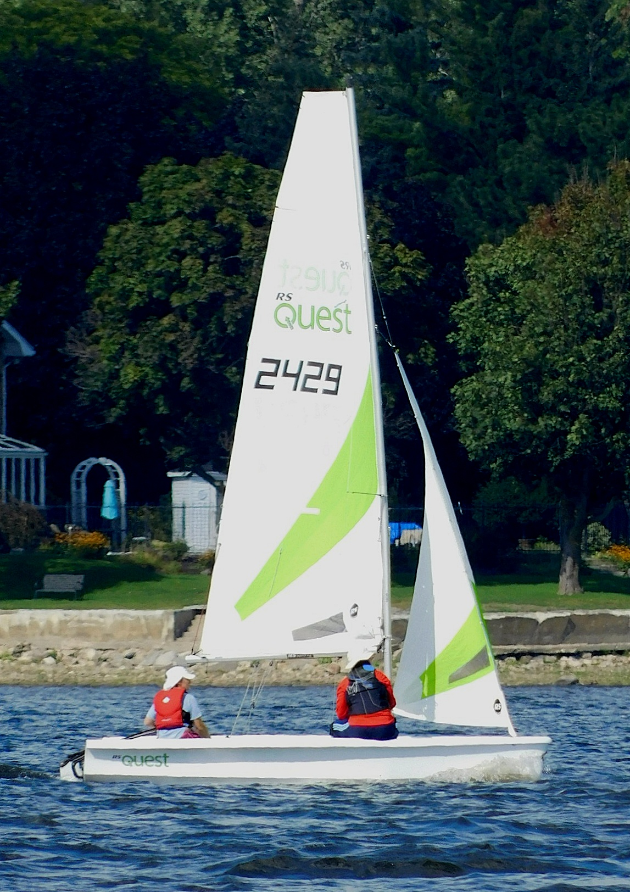
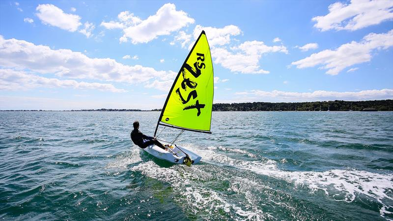

In spring/summer 2022 I took sailing lessons at the [Community Boating Center](https://www.communityboating.com/) in Providence, RI.

In 2022, I sailed quite a bit, but less so in the 2023 season.

In 2024, I could use this space for a sailing journal/log.

There are two boats I've taken out: the RS Quest and the RS Zest.

### Log

#### 2023

I sailed only three times in 2023. Once with Nick, once with Gabriel and once solo. Onward to 2024!

#### 2022-09-22
Took Will out on a sail on the RS Quest. Him sitting on the windward side of the boat with me made me feel like I was falling backward and found myself bracing myself strongly to not topple back. So I had him sit in the middle of the boat, which he said was comfortable and made the boat balance as I am used to.

#### 2022-10-02
Took Chloe and Camilo out for a sail in heavy winds and a heavy current, both in same direction, almost due west, perpendicular to the CBC dock. We went straight out and then turned around and went downwind, capsizing halfway across the little bay. One righted, we strained for about 15/20 min to make headway back towards the dock, but couldn't do it and Nick had to tow us in. I felt a bit defeated and am curious how I would have done on my own in the RS Zest, which Nick had suggested we take out. Nick said there were three challenges stacked: 

1. heavy wind
2. uneven and gusting wind that changed direction
3. heavy current. 

Maybe some of the most challenging conditions I'd face, or be allowed to face from CBC. What an end to the season! Thinking of having my classmates over for cocktails, clam chowder and beef stew. 

### Boats
#### RS Quest

#### RS Zest
